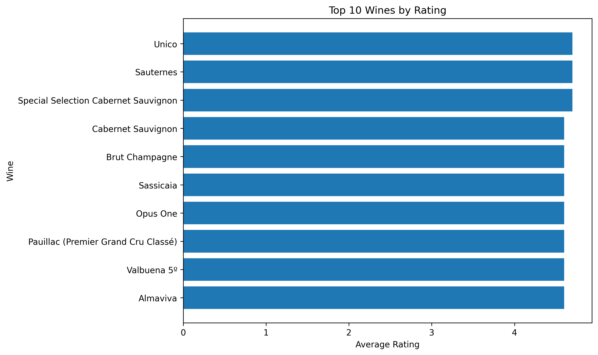
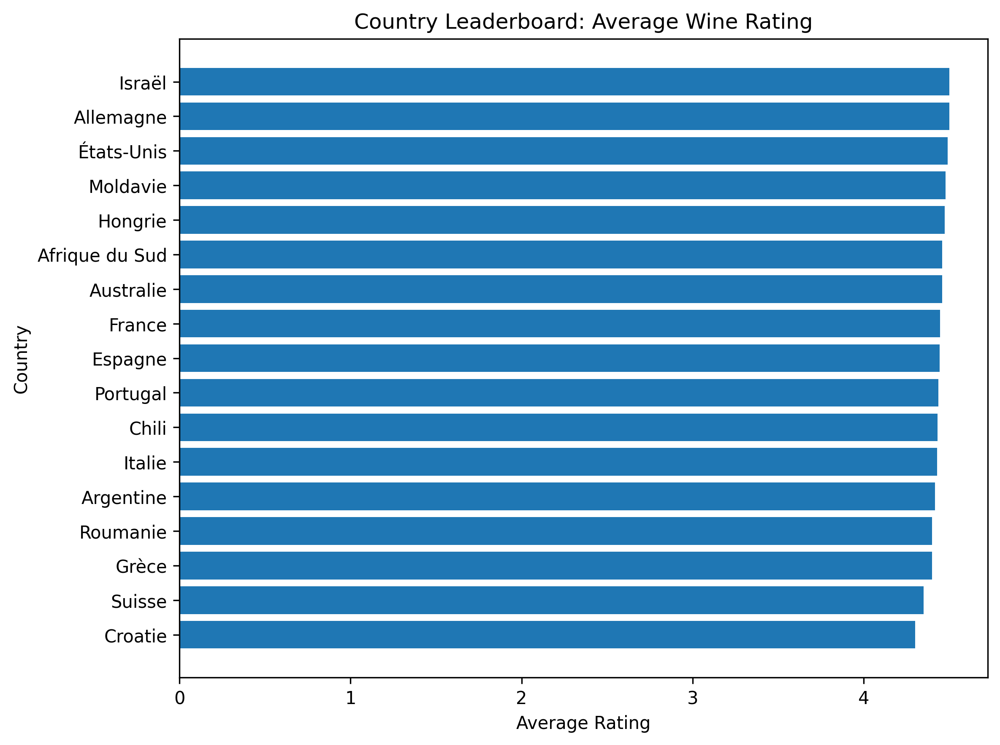
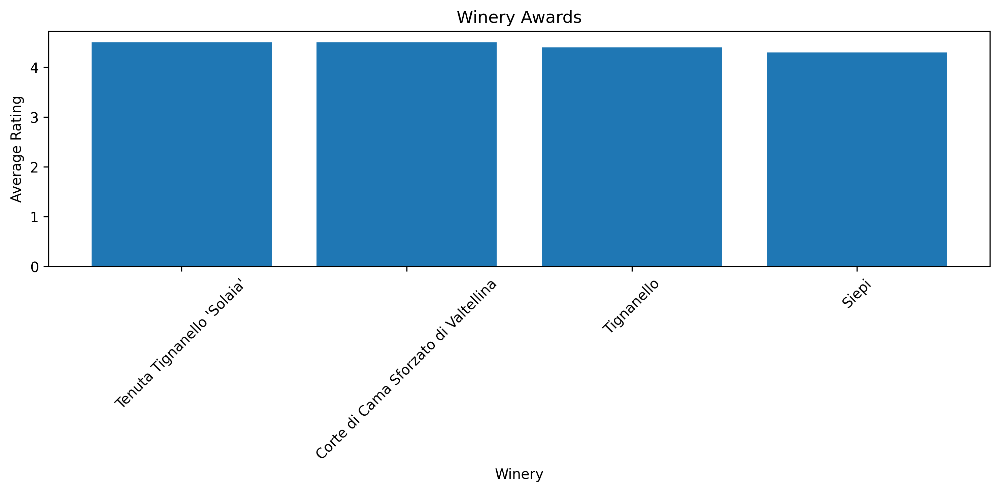
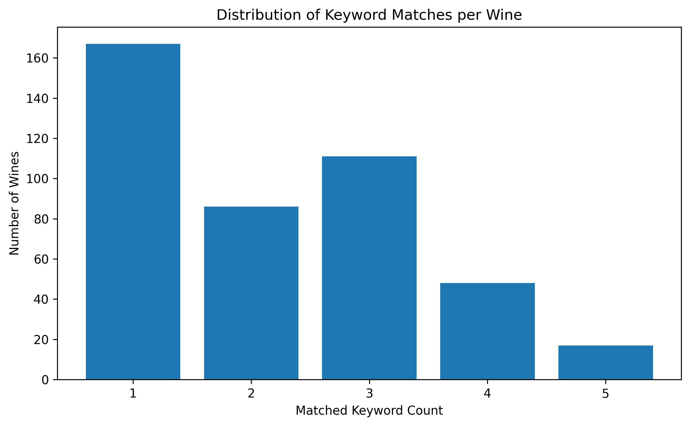
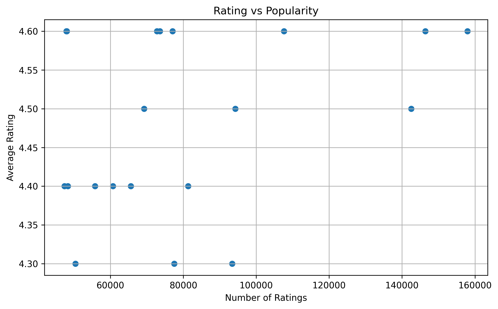
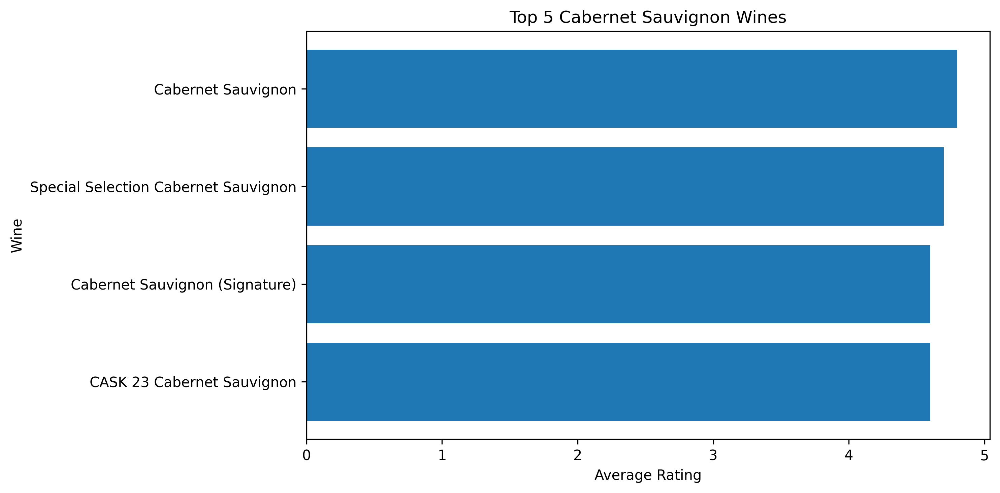

#  Wine Market Analysis 



---

##  Project Overview
This project delivers a **complete market analysis of the wine industry** using the Vivino dataset.  
It combines **SQL, Python, and Streamlit** to transform raw data into actionable business insights.

 The goal: help a wine company **optimize marketing, product selection, and customer targeting**.

---

##  Live Features
-  SQL-powered analysis (no pandas)
-  Automated chart generation
-  Business insights for each question
-  Interactive Streamlit dashboard
-  Clean, production-style project structure

---
##  Data Source

The dataset used in this project is provided by *BeCode* as part of a data analysis challenge.

It consists of a *SQLite database (vivino.db)* containing structured information about wines, including:

-  Wines (ratings, popularity, price)
-  Countries and regions
-  Wineries
-  Grapes
-  Flavor keywords and clusters
-  Vintage data

The database schema was explored and analyzed using SQL joins and aggregations to extract meaningful business insights.


##  Business Questions Answered

###  Top Wines to Promote


###  Country Priority


###  Winery Awards


###  Taste Keyword Cluster


###  Rating vs Popularity


###  Cabernet Sauvignon Recommendation


---

##  Key Insights

-  High rating + high volume wines are best for promotion  
-  France & Italy dominate quality and production  
-  Flavor keywords reveal strong customer preferences  
-  Popular wines are not always the highest rated  
-  Cabernet Sauvignon remains a strong VIP segment  

---

## 🗂️ Project Structure

```
wine_market_analysis/
│
├── data/
│   └── vivino.db
│
├── queries/
│   ├── business_questions/
│   └── exploration/
│
├── scripts/
│   ├── charts.py
│   ├── export_results.py
│   └── app.py
│
├── notebooks/
│   ├── 01_testing.ipynb
│   └── 02_analysis.ipynb
│
├── outputs/
│   ├── figures/
│   ├── tables/
│
├── optimization/
│   └── create_indexes.sql
│
├── README.md
└── requirements.txt
```

---

## ⚙️ Installation

```bash
git clone <git@github.com:JonbeshAhmadzai/Wine-Market-Analysis-SQL.git>
cd wine_market_analysis
python -m venv .venv
source .venv/bin/activate
pip install -r requirements.txt
```

---

##  Usage

### Generate charts
```bash
python scripts/charts.py
```

### Export results
```bash
python scripts/export_results.py
```

### Run dashboard
```bash
streamlit run scripts/app.py
```

---

## ⚡ Optimization

Indexes created in:
```
optimization/create_indexes.sql
```

✔ Faster joins  
✔ Faster aggregations  

---

##  Tech Stack

- SQL (SQLite)
- Python
- Matplotlib
- Streamlit

---

##  Limitations

- No direct grape-to-wine mapping  
- Some missing values  
- Keyword matching is case-sensitive  

---

##  Recommendations

- Improve schema (link grapes directly to wines)  
- Standardize keywords  
- Add richer pricing data  
- Introduce user segmentation  

---

## 👤 Author

**Jonbesh Ahmadzai**

---

##  Final Result

This project demonstrates a full data pipeline:

**SQL → Analysis → Visualization → Dashboard → Business Insights**

## Licence 
MIT 
